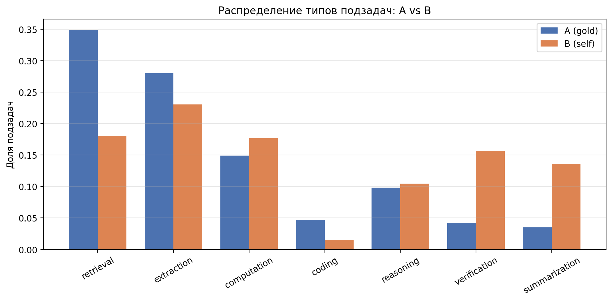
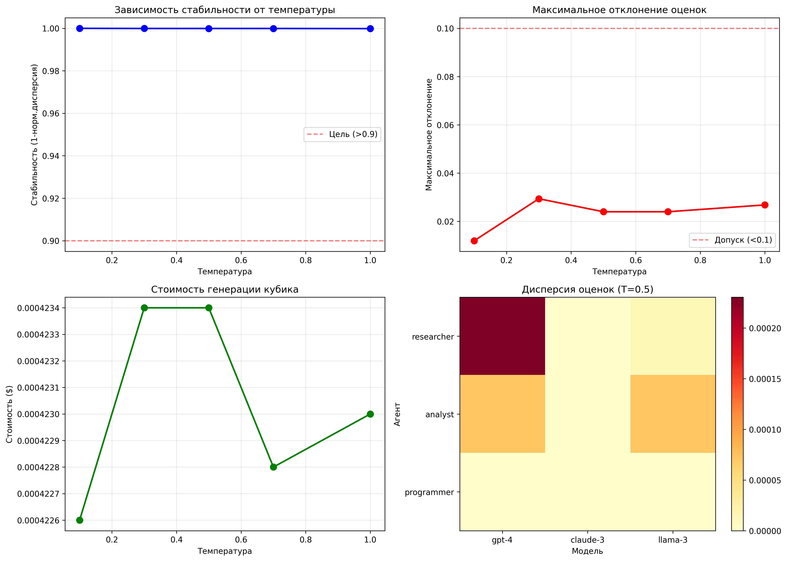
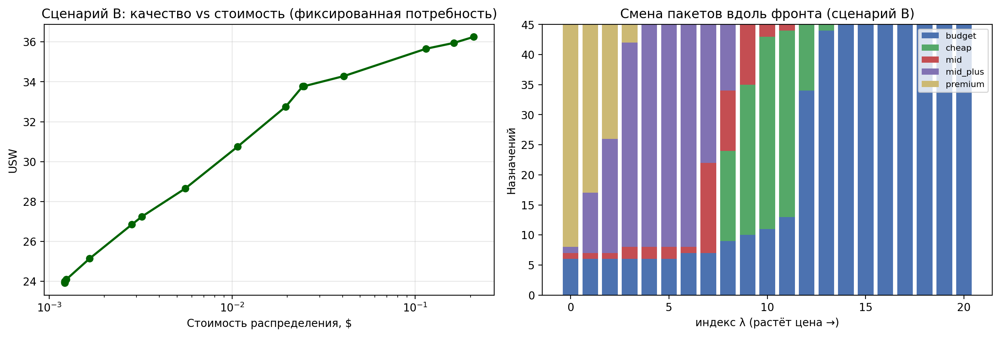
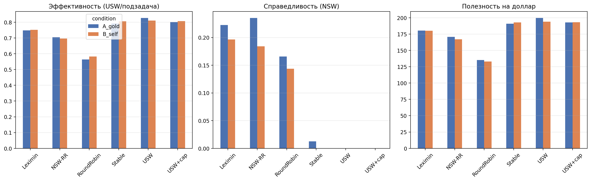
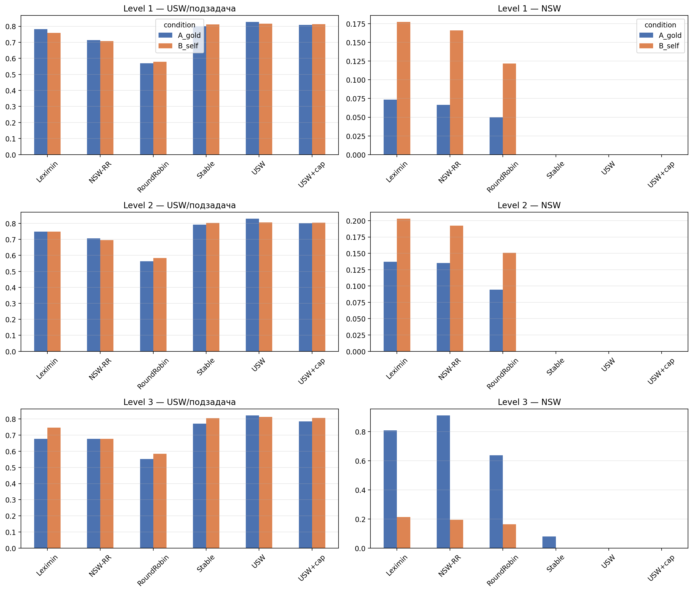
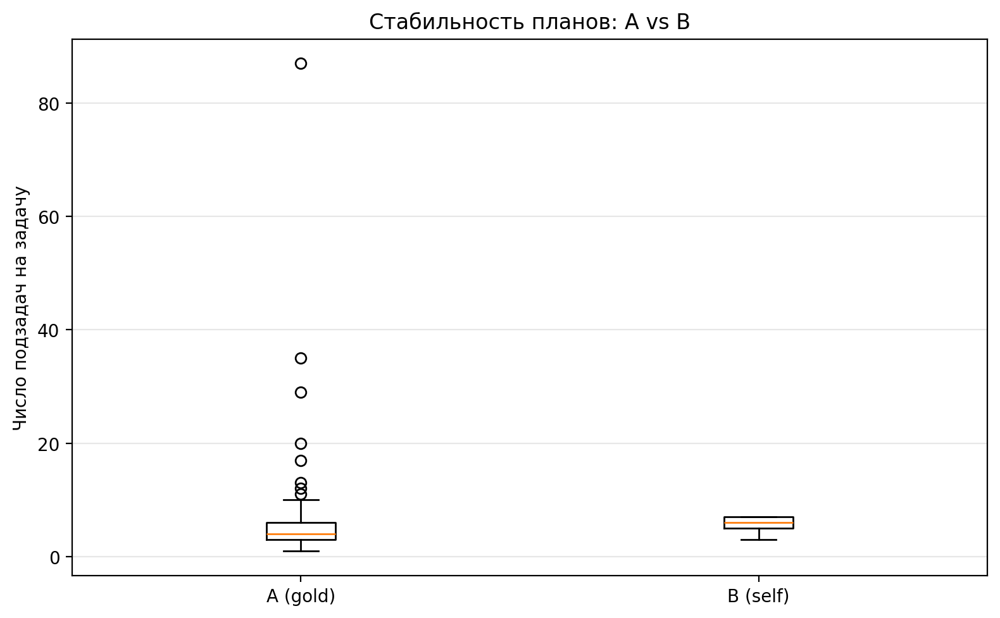
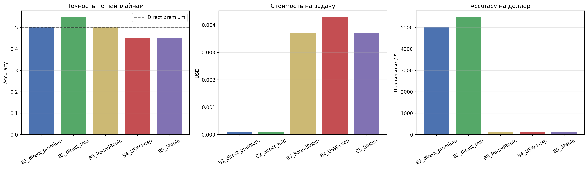

# Resource_allocation_in_an_LLM_multi-agent_system
resource allocation between agents in a multi-agent system based on large language models

# llm-resource-allocation

Распределение ресурсов между агентами в мультиагентной системе на основе больших языковых моделей.

## Цель проекта

Разработка и экспериментальная оценка модуля справедливого распределения LLM-ресурсов в мультиагентной системе для решения сложных задач из бенчмарка GAIA. Задача поставлена как **задача справедливого дележа** (fair division) с теоретико-игровыми критериями: ресурс ограничен, агенты специализированы, распределение должно быть одновременно эффективным, справедливым и экономически обоснованным.

## Основные компоненты

* **Декомпозитор** → разбивает задачу GAIA на последовательные подзадачи (два режима: эталонный план аннотатора и автономное планирование по сырому вопросу)
* **Классификатор** → присваивает подзадаче один из 7 типов по индуктивной таксономии
* **Оракул** → генерирует «кубик оценок», тензор `U ∈ [0,1]^(N×M×K)`
* **Роутер** → распределяет подзадачи по агентам и пакетам ресурса с критериями USW, NSW, Leximin, стабильного паросочетания
* **Агенты** (7 ролей: RESEARCHER, EXTRACTOR, ANALYST, PROGRAMMER, REASONER, CRITIC, WRITER) → исполняют подзадачи

```
GAIA-задача → Декомпозитор → [подзадачи] → Классификатор типов
                                                   ↓
                              Оракул → кубик U[задача × роль × пакет]
                                                   ↓
                                    Роутер (USW / NSW / Leximin / Stable)
                                                   ↓
                                        Агенты → результат
```

## Формальная модель

* `T = {t_1..t_N}` — подзадачи, `A = {a_1..a_M}` — агенты, `P = {p_1..p_K}` — пакеты ресурса
* Пакет = модель + токен-бюджет; бюджет **выводится из цены**, поэтому пакеты равны по стоимости: `b_k = C / c_k`, где `C = $0.005` — цена пакета, `c_k` — цена токена модели
* Кубик оценок `U[i,j,k]` — предсказанное качество выполнения подзадачи `i` агентом `j` на пакете `k`
* Распределение `D: i → (a(i), m(i))`, нагрузка агента `L_j = Σ_{i: a(i)=j} U[i,j,m(i)]`

## Техническая реализация

* **OpenRouter API**, 5 тарифных уровней, цены забираются по API на момент запуска (разброс 201× по цене токена, 115× по токен-бюджету пакета):

| Уровень | Модель | $/M токенов (смеш.) | Токенов в пакете |
|---|---|---|---|
| budget | mistralai/mistral-nemo | 0.022 | 131 072 |
| cheap | meta-llama/llama-3.1-8b-instruct | 0.058 | 86 956 |
| mid | openai/gpt-4o-mini | 0.263 | 19 047 |
| mid_plus | anthropic/claude-3-haiku | 0.500 | 10 000 |
| premium | openai/gpt-4o | 4.375 | 1 142 |

* **Оракул**: гибридная оценка (эвристика по матрицам совместимости + пакетный LLM-запрос, заполняющий всю матрицу 7×5 за один вызов вместо 35)
* **Данные**: GAIA 2023 validation, 165 задач, уровни 1–3
* **Инфраструктура**: Google Colab / локальный Jupyter, чекпоинты для длительных прогонов

## Результаты

### 1. Таксономия и классификатор подзадач

Априорная таксономия из 5 типов не работала: 43.2% шагов не классифицировались и попадали в `ANALYSIS` по умолчанию, из-за чего аналитик получал 54% работы как «наследник мусорной корзины», а программист — 5.4%. Построена индуктивная таксономия из 7 типов с codebook; классификация переведена на LLM при `T=0`.

Валидация на 100 шагах с ручной разметкой:

| Классификатор | Точность | κ Коэна |
|---|---|---|
| Ключевые слова (baseline) | 62.0% | 0.446 |
| **LLM, T=0, с codebook** | **92.0%** | **0.884** |

Семантические типы (`reasoning`, `verification`) ключевыми словами не выявляются принципиально.

<!-- ИЗОБРАЖЕНИЕ 2: распределение типов подзадач -->
<!-- Вставить: docs/type_distribution.png (источник: experiments/plot_type_distribution_*.png) -->


### 2. Структура кубика оценок: задача сепарабельна

Проверена гипотеза о взаимодействии «роль × модель». Доля дисперсии `log U`, не объяснимая аддитивной моделью «роль + модель» (логарифм с двойным центрированием):

| Кубик | Чистое взаимодействие | Разброс внутри среза |
|---|---|---|
| Эвристика | 1.8% | 0.177 |
| С LLM-уточнением | 3.2% | 0.178 |

Оба значения ниже порога 5%, `argmax` совпадает с покомпонентным выбором в 100% случаев. **Вывод: выбор роли и выбор модели независимы, задача распределения декомпозируется.** Это упрощает оптимизацию и является самостоятельным результатом: «качество роли для типа подзадачи» и «мощность модели» — ортогональные факторы.

### 3. Стабильность оракула

Установлено, что при `T=0` оценщик **недетерминирован**: коэффициент вариации 0.059, стабильность решений роутера 82.5% на стратифицированной подвыборке (19 подзадач, все типы).

| Температура | Стабильность решений | CV |
|---|---|---|
| 0.0 | 82.5% | 0.059 |
| 0.3 | 86.0% | 0.073 |
| 0.7 | 56.1% | 0.101 |
| 1.0 | 45.6% | 0.102 |

`T ≥ 0.7` непригодны. Рабочий кубик строится как медиана трёх прогонов; шум оракула `std = 0.033` задаёт порог значимости `0.099` для всех последующих сравнений.

<!-- ИЗОБРАЖЕНИЕ 3: стабильность по температурам -->
<!-- Вставить: docs/stability.png (источник: experiments/stability_analysis_*.png) -->


### 4. Сравнение роутеров и отклонение от точного оптимума

Точный оптимум USW получен через MILP, оптимум NSW — через max-min с итеративным перевзвешиванием (45 подзадач):

| Роутер | USW | Регрет USW | NSW | Регрет NSW | Блокирующих пар | EF1 |
|---|---|---|---|---|---|---|
| USW | 40.17 | 0.00% | 0.000 | 100% | 0 | нет |
| USW+cap | 37.22 | 7.35% | 4.018 | 16.52% | 28 | нет |
| Stable | 36.35 | 9.51% | 3.608 | 25.04% | **0** | нет |
| NSW-RR | 33.14 | 17.50% | 4.719 | **1.96%** | 54 | **да** |
| Leximin | 28.46 | 29.16% | 4.060 | 15.64% | 144 | нет |
| RoundRobin | 23.28 | 42.04% | 3.210 | 33.31% | 111 | нет |

**Price of Fairness = 16.12%** — столько эффективности теряется при переходе от оптимума по качеству к оптимуму по справедливости.

Ключевые наблюдения:
* Чистый USW оставляет 2 из 7 агентов без работы (`NSW = 0`, `Gini = 0.583`, зависть 9.24) — эффективность достигается ценой полного отказа от справедливости.
* NSW методом поочерёдного выбора — единственный роутер с гарантией **EF1** и регретом по NSW менее 2%.
* Стабильное паросочетание даёт **нуль блокирующих пар** и статистически неотличимо от USW+cap по качеству, но не требует централизованного принуждения к исполнению.
* Без ограничения ёмкости чистый USW также даёт 0 блокирующих пар: стабильность нарушается только при конкуренции за ограниченный ресурс.

Статистическая значимость (парный критерий Уилкоксона, bootstrap-интервалы, 10 задач): все роутеры значимо превосходят Round Robin (`p ≤ 0.0039`). Роутеры образуют три различимые группы: USW (0.901) > {USW+cap, Stable, Leximin: 0.816–0.867} > NSW-RR (0.760) > RoundRobin (0.560). Внутри средней группы различия незначимы (`p > 0.05`), что позволяет выбирать роутер по вторичным критериям — стабильности и справедливости.

### 5. Парето-фронт «качество / стоимость»

Целевая функция роутера `max Σ (U − λ·cost)`; свип по `λ` даёт фронт компромиссов.

**Сценарий A — фиксированная стоимость пакета.** `λ=0`: USW 37.22 при $0.212, premium выбран в 37 из 45 подзадач. `λ→∞`: USW 24.60 при $0.128, только budget. Максимум полезности на доллар при `λ=158.5`: 82.9% качества за 73.7% стоимости.

**Сценарий B — фиксированная потребность в токенах** (реальная стоимость выполнения подзадачи, разброс цен 464×): максимум USW 36.26 при $0.2088; максимум полезности на доллар при `λ=5456`: **66.2% качества за 0.6% стоимости — в 172 раза дешевле**.

Практический вывод: для большинства подзадач GAIA премиальная модель экономически неоправданна.

<!-- ИЗОБРАЖЕНИЕ 4: Парето-фронт, сценарий B -->
<!-- Вставить: docs/pareto_tokens.png (источник: experiments/paretoB_*.png) -->


### 6. Основной эксперимент: происхождение плана (165 задач)

Два условия на одном наборе задач при идентичных оракуле и роутерах:
* **A_gold** — подзадачи из шагов аннотатора GAIA (эталонный план, 886 подзадач);
* **B_self** — автономная декомпозиция LLM-планировщиком по сырому вопросу (986 подзадач).

| Роутер | USW (A_gold) | USW (B_self) | B/A | Gini A → B | Простой агентов A → B |
|---|---|---|---|---|---|
| USW | 0.8272 | 0.8109 | 98.0% | 0.680 → 0.514 | 4.33 → 2.88 |
| USW+cap | 0.8010 | 0.8076 | 100.8% | 0.577 → 0.473 | 3.67 → 2.68 |
| Stable | 0.7921 | 0.8062 | 101.8% | 0.586 → 0.476 | 3.68 → 2.69 |
| Leximin | 0.7479 | 0.7516 | 100.5% | 0.449 → 0.224 | 2.78 → 1.02 |
| NSW-RR | 0.7047 | 0.6970 | 98.9% | 0.467 → 0.261 | 2.78 → 1.02 |
| RoundRobin | 0.5635 | 0.5823 | 103.3% | 0.505 → 0.286 | 2.78 → 1.02 |

**Цена несовершенной декомпозиции: −0.4%** — то есть автономный план не хуже эталонного. Ранжирование роутеров сохраняется в обоих условиях.

Дополнительные наблюдения:
* Автономный декомпозитор радикально стабильнее по объёму плана: 5.98 ± 0.82 подзадач против 5.37 ± 7.60 у аннотатора.
* Автономный план использует все 7 типов, эталонный — только 5. Аннотатор пропускает `verification` (16% против 2%) и `summarization` (14% против 1%) как «очевидные» шаги. Расхождение распределений типов по Йенсену–Шеннону: 0.145.
* Распределение по автономному плану **справедливее**: Gini ниже у всех роутеров, простой агентов сокращается втрое.
* Стоимость: $0.0224 на задачу в условии A, $0.0252 в условии B; при этом в условии A стоимость растёт с уровнем сложности ($0.0145 → $0.0478), а в условии B остаётся постоянной.

<!-- ИЗОБРАЖЕНИЕ 5: главный результат, A против B -->
<!-- Вставить: docs/main_result_ab.png (источник: experiments/plot_ab_overall_*.png) -->


<!-- ИЗОБРАЖЕНИЕ 6: разбивка по уровням сложности -->
<!-- Вставить: docs/ab_by_level.png (источник: experiments/plot_ab_by_level_*.png) -->


<!-- ИЗОБРАЖЕНИЕ 7: стабильность объёма плана -->
<!-- Вставить: docs/plan_stability.png (источник: experiments/plot_plan_stability_*.png) -->


Практический итог: **система не нуждается в экспертной разметке плана.** Оракул и роутеры применимы к полностью автономному конвейеру, что снимает зависимость от аннотаций GAIA и делает результаты переносимыми.

## Ограничения

**End-to-end прогон проведён в конфигурации без внешних инструментов** — цель состояла в изоляции вклада маршрутизации. Результат на 20 задачах:

| Конвейер | Точность | Стоимость/задача |
|---|---|---|
| Прямой запрос, premium | 50.0% | $0.00010 |
| Прямой запрос, mid | 55.0% | $0.00010 |
| RoundRobin | 50.0% | $0.00370 |
| USW+cap | 45.0% | $0.00430 |
| Stable | 45.0% | $0.00370 |

При `n = 20` доверительный интервал точности составляет ±22%, поэтому все конвейеры статистически неразличимы. Задачи GAIA спроектированы под многошаговое взаимодействие с внешними ресурсами (скачать PDF, открыть страницу, посмотреть видео); без инструментов все конвейеры упираются в один потолок, и маршрутизация его не сдвигает. **Это отрицательный контроль, а не результат сравнения роутеров:** он показывает, что вклад распределения ресурсов проявляется в метриках распределения, а не в end-to-end точности при отсутствующей инструментальной поддержке.

<!-- ИЗОБРАЖЕНИЕ 8: end-to-end, точность и стоимость -->
<!-- Вставить: docs/e2e.png (источник: experiments/e2e_accuracy_cost_*.png) -->


Прочие ограничения:
* Кубик `U` не калиброван против фактической успешности исполнения — все метрики распределения работают в шкале предсказаний оракула.
* Матрицы совместимости заданы как априорная экспертная инициализация и подлежат калибровке на данных исполнения.
* Оценка `max_envy` использует модель, назначенную другому агенту; более строгий вариант допускает пересчёт под лучшую для завидующего агента модель.

## Воспроизведение

```bash
pip install -q openai datasets huggingface-hub numpy pandas matplotlib seaborn scipy
```

В ноутбуке `python_files/experiments_p1.ipynb` задать `OPENROUTER_API_KEY` и `HF_TOKEN`, затем выполнять ячейки по порядку. Часть 1 воспроизводит baseline (3 агента, 3 модели), часть 2 — расширенную конфигурацию (7 ролей, 5 моделей) и все эксперименты. Длительные прогоны сохраняют чекпоинты в `experiments/`.

Суммарные затраты на API при полном воспроизведении: около $0.6 (оракул на 165 задачах в двух условиях — $0.51).

## Дальнейшая работа

* Калибровка кубика: исполнение подвыборки комбинаций «подзадача–агент–модель» и измерение связи предсказания с фактом (Спирмен, AUC, калибровочная кривая)
* Обучаемый оракул на логах исполнения (тензорная факторизация, проверка ранга взаимодействия на данных)
* Инструментальная поддержка агентов (веб-поиск, парсинг файлов) для осмысленного end-to-end замера на GAIA
* Механизмы с денежной семантикой: CEEI, VCG
* Масштабирование до 10+ агентов, параллельное выполнение независимых подзадач


